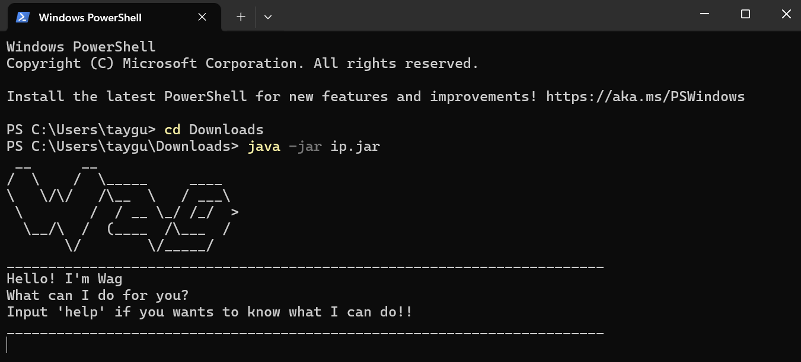

# Wag Task Manager - User Guide

## Table of Contents

- [Introduction](#introduction)
- [Getting Started](#getting-started)
- [Commands](#commands)
    - [Adding Tasks](#adding-tasks)
    - [Listing Tasks](#listing-tasks)
    - [Marking Tasks as Done](#marking-tasks-as-done)
    - [Unmarking Tasks](#unmarking-tasks)
    - [Deleting Tasks](#deleting-tasks)
    - [Finding Tasks](#finding-tasks)
    - [Help](#help)
    - [Exiting the Application](#exiting-the-application)
- [Examples](#examples)
- [Troubleshooting](#troubleshooting)
- [Command Summary](#command-summary)

## Introduction

Wag Task Manager is a simple command-line task management application. It helps users keep track of their tasks by allowing them to add, delete, and mark tasks as done.

## Getting Started

### Prerequisites
- Ensure you have **Java 17** or above installed on your computer.
- **Mac users:** Ensure you have the precise JDK version prescribed [here](https://se-education.org/guides/tutorials/javaInstallationMac.html).

### Installation
1. Download the latest `.jar` file from [here](https://github.com/TayGuangSheng/ip/releases/tag/A-Release).
2. Copy the file to the folder you want to use as the home folder for your **AddressBook**.

### Running the Application
1. Open a command terminal.
2. Navigate to the folder containing the `.jar` file using:
    ```sh
    cd path/to/your/folder
    ```
3. Run the application with:
    ```sh
    java -jar ip.jar
    ```
4. A GUI similar to the one below should appear in a few seconds.



### Using the Application
- Type commands in the command box and press **Enter** to execute them.
- Example: typing `help` and pressing **Enter** will open the help window.
- Refer to the sections below for details on each command.

## Commands

Wag Task Manager supports various commands to help you manage your tasks effectively.

### Adding Tasks

You can add three types of tasks:

- **Todo**: A basic task with just a description.
  ```sh
  todo Read a book
  ```
- **Deadline**: A task with a due date. Date Format is DD/MM/YYYY HHmm
  ```sh
  deadline Submit report /by 02/03/2025 0600
  ```
- **Event**: A task that occurs from a specific time to a specific time. Date Format is DD/MM/YYYY HHmm
  ```sh
  event Team meeting /from 02/03/2025 0600 /to 02/03/2025 1800
  ```

### Listing Tasks

To view all tasks, use:

```sh
list
```

### Marking Tasks as Done

To mark a task as done:

```sh
mark 2
```

*This marks task #2 as completed.*

### Unmarking Tasks

To unmark a task as not done:

```sh
unmark 2
```

*This unmarks task #2 as uncompleted.*

### Deleting Tasks

To remove a task:

```sh
delete 3
```

*This deletes task #3 from the list.*

### Finding Tasks

To search for tasks containing a keyword:

```sh
find report
```

### Help

To list all the functions of Wag:

```sh
help
```

### Exiting the Application

To exit Wag Task Manager, type:

```sh
bye
```

## Examples

```
________________________________________________________________________
Hello! I'm Wag
What can I do for you?
________________________________________________________________________
> todo Read a book
________________________________________________________________________
Got it. I've added this task:
  [T][ ] Read a book
Now you have 1 tasks in the list.
________________________________________________________________________
> deadline Submit report /by 02/03/2025 0600
________________________________________________________________________
Got it. I've added this task:
  [D][ ] Submit report (by: Mar 2 2025, 6:00AM)
Now you have 2 tasks in the list.
________________________________________________________________________
> event Team meeting /from 02/03/2025 0600 /to 02/03/2025 1800
________________________________________________________________________
Got it. I've added this task:
  [E][ ] Team meeting (from: Mar 2 2025, 6:00AM to: Mar 2 2025, 6:00PM)
Now you have 3 tasks in the list.
________________________________________________________________________
> list
________________________________________________________________________
Here are the tasks in your list:
1. [T][ ] Read a book
2. [D][ ] Submit report (by: Mar 2 2025, 6:00AM)
3. [E][ ] Team meeting (from: Mar 2 2025, 6:00AM to: Mar 2 2025, 6:00PM)
________________________________________________________________________
> mark 2
________________________________________________________________________
Nice! I've marked this task as done:
  [D][X] Submit report (by: Mar 2 2025, 6:00AM)
________________________________________________________________________
> unmark 2
________________________________________________________________________
OK, I've marked this task as not done yet:
  [D][ ] Submit report (by: Mar 2 2025, 6:00AM)
________________________________________________________________________
> delete 3
________________________________________________________________________
Noted. I've removed this task:
  [E][ ] Team meeting (from: Mar 2 2025, 6:00AM to: Mar 2 2025, 6:00PM)
Now you have 2 tasks left in the list.
________________________________________________________________________
> find report
________________________________________________________________________
Here are the matching tasks in your list:
1. [D][ ] Submit report (by: Mar 2 2025, 6:00AM)
________________________________________________________________________
> bye
________________________________________________________________________
Here are the available commands:
- todo <description>: Adds a new todo task
- deadline <description> /by <date>: Adds a task with a deadline
- event <description> /from <data> /to <date>: Adds an event task
- list: Displays all tasks
- mark <task number>: Marks a task as done
- unmark <task number>: Marks a task as not done
- delete <task number>: Deletes a task
- find <keyword>: Finds tasks containing the keyword
- help: Displays this help message
- bye: Exits the application
________________________________________________________________________
Bye. Hope to see you again soon!
________________________________________________________________________
```

## Troubleshooting

- **Invalid Command**: Ensure commands are typed correctly. 
- **Task Not Found**: Check if the task number exists in the list. Input 'list'.
- **Date Format Issues**: Use `DD/MM/YYYY HHmm` for dates (e.g. 25/09/2025 0600)
- **Application Crashes**: Try restarting the app and checking `tasks.txt` for issues.

## Command Summary

| Action                  | Format                                        | Example                                                        |
|-------------------------|-----------------------------------------------|----------------------------------------------------------------|
| Add a Todo Task         | `todo <description>`                          | `todo Read a book`                                             |
| Add a Deadline Task     | `deadline <description> /by <date time>`      | `deadline Submit report /by 02/03/2025 0600`                   |
| Add an Event Task       | `event <description> /from <start> /to <end>` | `event Team meeting /from 02/03/2025 0600 /to 02/03/2025 1800` |
| List Tasks              | `list`                                        | `list`                                                         |
| Mark Task as Done       | `mark <task number>`                          | `mark 2`                                                       |
| Unmark Task as Not Done | `unmark <task number>`                        | `unmark 2`                                                     |
| Delete Task             | `delete <task number>`                        | `delete 3`                                                     |
| Find Task               | `find <keyword>`                              | `find report`                                                  |
| Help                    | `help`                                        | `help`                                                         |
| Exit Application        | `bye`                                         | `bye`                                                          |


---

Enjoy using Wag Task Manager! 

